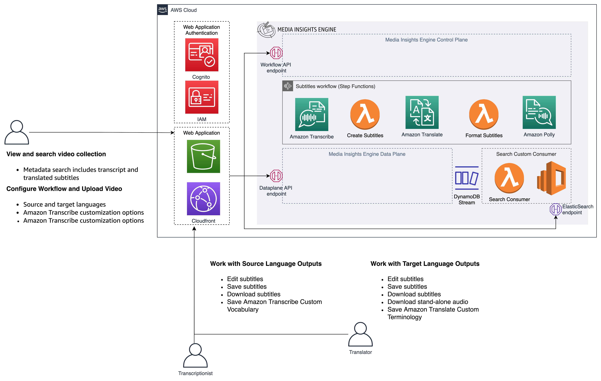
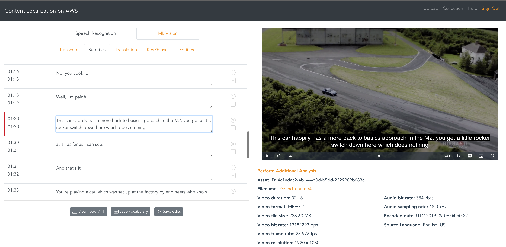
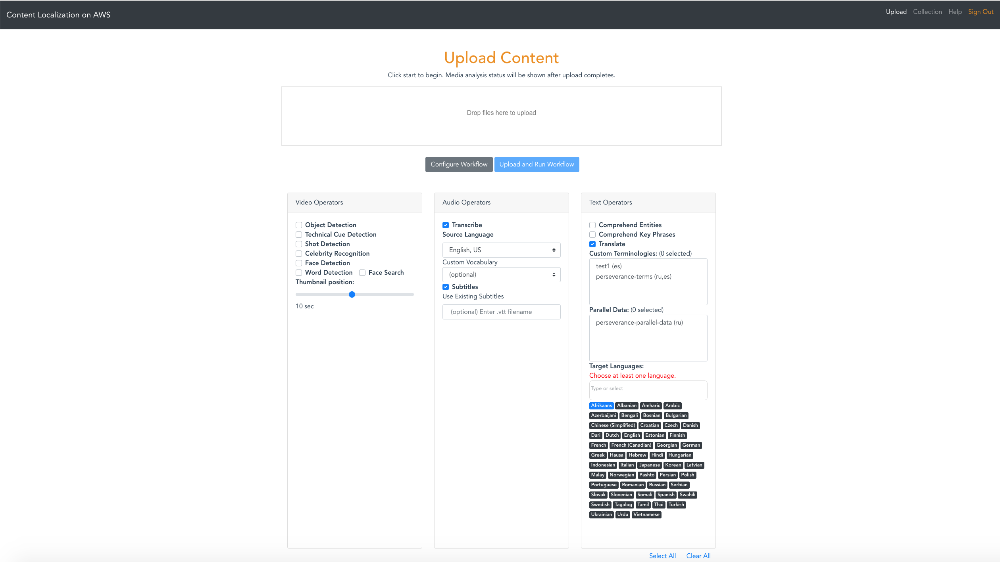
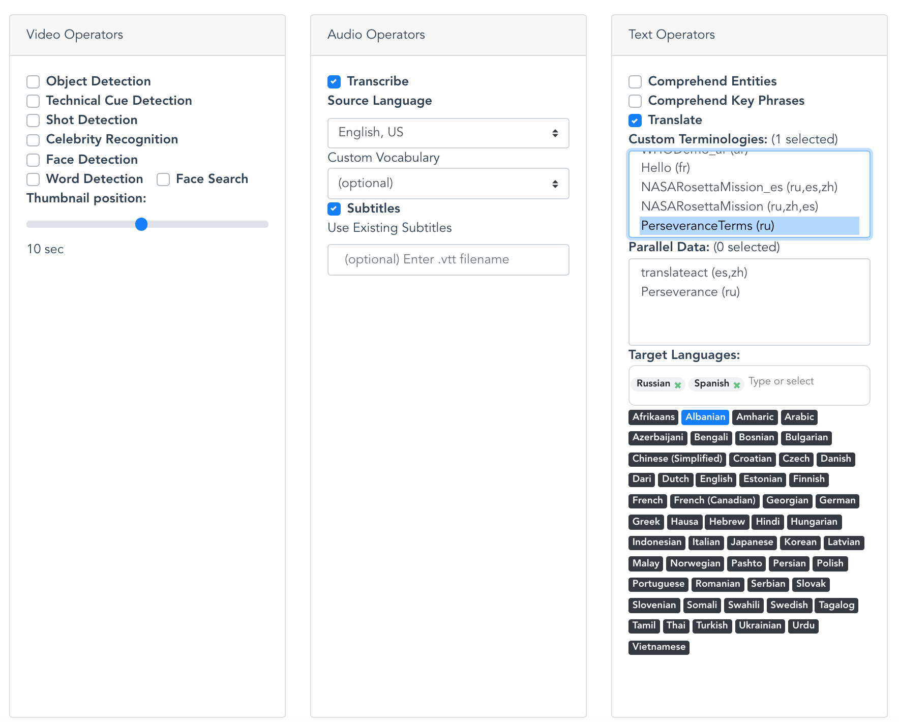

# Content Localization on AWS 

Welcome to the Content Localization on AWS project!   This project will help you extend the reach of your VOD content by quickly and efficiently creating accurate multi-language subtitles using AWS AI Services.  You can make manual corrections to the automatically created subtitles and use advanced AWS AI Service customization features to improve the results of the automation for your content domain. Content Localization is built on [Media Insights on AWS](https://github.com/aws-solutions/media-insights-on-aws), a framework that helps accelerate the development of serverless applications that process video, images, audio, and text with artificial intelligence services and multimedia services on AWS. 


Localization is the process of taking video content that was created for audiences in one geography and transforming it to make it relevant and accessible to audiences in a new geography.  Creating alternative language subtitle tracks is central to the localization process.  This application presents a guided experience for automatically generating and correcting subtitles for videos in multiple languages using AWS AI Services.  The corrections made by editors can be used to customize the results of AWS AI services for future workflows.  This type of AI/ML workflow, which incorporates user corrections is often referred to as “human in the loop”.

Content Localization workflows can make use of advanced customization features provided by Amazon Transcribe and Amazon Translate:

* [Amazon Transcribe Custom Vocabulary](https://docs.aws.amazon.com/transcribe/latest/dg/how-vocabulary.html) - you provide Amazon Transcribe with a list of terms that are specific to your content and how you want the terms to be displayed in transcipts
* [Amazon Transcribe Custom Language Models](https://docs.aws.amazon.com/transcribe/latest/dg/custom-language-models.html) - you provide Amazon Transcribe with domain-specific text data that is representative of the audio you want to transcribe. 
* [Amazon Translate Custom Terminologies](https://docs.aws.amazon.com/translate/latest/dg/how-custom-terminology.html) - you provide Amazon Translate with a list of terms or phrases in the source language content and specify how you want them to appear in the translated result.
* [Amazon Translate Parallel Data for Active Custom Translation](https://docs.aws.amazon.com/translate/latest/dg/customizing-translations-parallel-data.html) - you provide Amazon Translate with a list of parallel phrases: the source language and the pharase tranlated the way you want it.  The Parallel Data customizes Amazon Translate models so they create more contectual translations based on the sample you provide.

Application users can manually correct the results of the automation at different points in the automated workflow and then trigger a new workflow to inclue their corrections in downstream processing.  Corrections are tracked and can be used to update Amazon Transcribe Custom Vocabularies and Amazon Translate Custom Terminologies to improve future results.  


### Why use customizations and human-in-the-loop?

Automating the creation of translated subtitles using AI/ML promises to speed up the process of localization for your content, but there are still challenges to acheive the level of accuracy that is required for specific use cases.  With natural language processing, many aspects of the content itself may determine the level of accuracy AI/ML analysis is capable of achieving.  Some content characteristics that can impact transcription and translation accuracy include: domain specific language, speaker accents and dialects, new words recently introduced to common language, the need for contextual interpretation of ambiguous phases, and correct translation of proper names.   AWS AI services provide a variety of features to help customize the results of the machine learning to specific content.   Therefore, the workflow in this application seeks to provide users with a guided experience to use these customization features as an extension of their normal editing workflow.

### Doesn’t content localization involve more than just subtitles?

As a first step, this project seeks to create an efficient, customizable workflow for creating multi-language subtitles.  We hope that this project will grow to apply AWS more AI Services to help automate other parts of the localization process.  For this reason, the application workflow includes the options to generate other useful types of analysis available in AWS AI Services.  While this analysis is not performed in the base workflow, developers can enable it to explore the available data to help with extending the application.  Here are some ideas to inspire the builders out there to extend this application:

* Identifying names of people within the collection and auto-suggesting or correcting them in subtitiles.  People may be identified using voice recognition with Amazon Transcribe, or with Amazon Rekognition Celebrity Recognition, or Face  Search.
* Identify text or phrases in the visual content that may need to be translated.
* Use shot boundary and location of visual artifacts withing the content to help with placement of subtitles within relative to the content.

# Deployment

The following Cloudformation templates will deploy the Content Localization front-end application with a prebuilt version of the most recent Media Insights on AWS release.

Region| Launch
------|-----
US West (Oregon) | [](https://console.aws.amazon.com/cloudformation/home?region=us-west-2#/stacks/new?stackName=clo&templateURL=https://solutions-reference.s3.amazonaws.com/content-localization-on-aws/latest/content-localization-on-aws.template)
US East (N. Virginia) | [](https://console.aws.amazon.com/cloudformation/home?region=us-east-1#/stacks/new?stackName=clo&templateURL=https://solutions-reference.s3.amazonaws.com/content-localization-on-aws/latest/content-localization-on-aws.template)
EU West (Ireland) | [](https://console.aws.amazon.com/cloudformation/home?region=eu-west-1#/stacks/new?stackName=clo&templateURL=https://solutions-reference.s3.amazonaws.com/content-localization-on-aws/latest/content-localization-on-aws.template)

For more installation options, see the [Advanced Installation](#advanced-installation-options) section.

# Screenshots

Translation analysis:



Workflow configuration:




# COST

You are responsible for the cost of the AWS services used while running this application. The primary cost factors are from using Amazon Rekognition, Amazon Transcribe, Amazon Translate, Amazon Comprehend, Amazon Polly and Amazon OpenSearch Service (successor to Amazon Elasticsearch Service). With all services enabled, Videos cost about $0.50 per minute to process, but can vary between $0.10 per minute and $0.60 per minute depending on the video content and the types of analysis enabled in the application.  The default workflow for Content Localization only enables Amazon Transcribe, Amazon Translate, Amazon Comprehend, and Amazon Polly.   Data storage and Amazon ES will cost approximately ***$10.00 per day*** regardless of the quantity or type of video content.

After a video is uploaded into the solution, the costs for processing are a one-time expense. However, data storage costs occur daily.

For more information about cost, see the pricing webpage for each AWS service you will be using in this solution. If you need to process a large volume of videos, we recommend that you contact your AWS account representative for at-scale pricing. 


# Subtitle workflow

After uploading a video or image in the GUI, the application runs a workflow in Media Insights on AWS that extracts insights using a variety of media analysis services on AWS and stores them in a search engine for easy exploration. The following flow diagram illustrates this workflow:

[Image: Workflow.png]
This application includes the following features:


* Proxy encode of videos and separation of video and audio tracks using **AWS Elemental MediaConvert**. 
* Convert speech to text from audio and video assets using **Amazon Transcribe**.
* Convert Transcribe transcripts to subtitles
* Convert subtitles from one language to another using **Amazon Translate**.
* Generate a voice audio track for translations using **Amazon Polly**

Users can enable or disable operators in the upload view shown below:




# Search Capabilities:

The search field in the Collection view provides the ability to find media assets that contain specified metadata terms. Search queries are executed by Amazon OpenSearch, which uses full-text search techniques to examine all the words in every metadata document in its database. Everything you see in the analysis page is searchable. Even data that is excluded by the threshold you set in the Confidence slider is searchable. Search queries must use valid Lucene syntax.

Here are some sample searches:

* Search for filenames containing the suffix ".mp4" with, `*.mp4` or `filename:*.mp4`
* Since Content Moderation returns a "Violence" label when it detects violence in a video, you can search for any video containing violence simply with: `Violence`
* Search for videos containing violence with a 80% confidence threshold: `Violence AND Confidence:>80` 
* The previous queries may match videos whose transcript contains the word "Violence". You can restrict your search to only Content Moderation results, like this: `Operator:content_moderation AND (Name:Violence AND Confidence:>80)`
* To search for Violence results in Content Moderation and guns or weapons identified by Label Detection, try this: `(Operator:content_moderation AND Name:Violence AND Confidence:>80) OR (Operator:label_detection AND (Name:Gun OR Name:Weapon))`  
* You can search for phrases in Comprehend results like this, `PhraseText:"some deep water" AND Confidence:>80`
* To see the full set of attributes that you can search for, click the Analytics menu item and search for "*" in the Discover tab of Kibana.

# Advanced Installation Options

## Building the solution from source code

The following commands will build the Content Localization solution from source code. Be sure to define values for `EMAIL`, `WEBAPP_STACK_NAME`, and `REGION` first.

```
EMAIL=[specify your email]
WEBAPP_STACK_NAME=[specify a stack name]
REGION=[specify a region]
VERSION=1.0.0
git clone https://github.com/aws-solutions/content-localization-on-aws
cd content-localization-on-aws
cd deployment
DATETIME=$(date '+%s')
DIST_OUTPUT_BUCKET=content-localization-on-aws--frontend-$DATETIME
aws s3 mb s3://$DIST_OUTPUT_BUCKET-$REGION --region $REGION
aws s3 mb s3://$TEMPLATE_OUTPUT_BUCKET --region $REGION
./build-s3-dist.sh --template-bucket ${TEMPLATE_OUTPUT_BUCKET} --code-bucket ${DIST_OUTPUT_BUCKET} --version ${VERSION} --region ${REGION}
./sync-s3-dist.sh --template-bucket ${TEMPLATE_OUTPUT_BUCKET} --code-bucket ${DIST_OUTPUT_BUCKET} --version ${VERSION} --region ${REGION}
```


Once you have built the demo app with the above commands, then it's time to deploy it. You have two options, depending on whether you want to deploy over an existing Media Insights on AWS stack or a new one:

#### *Option 1:* Install Content Localization on AWS over an existing Media Insights on AWS stack

Use these commands to deploy the demo app over an existing Media Insights on AWS stack:


```
MIE_STACK_NAME=[specify the name of your exising Media Insights on AWS stack]
TEMPLATE=[copy "With existing Media Insights on AWS deployment" link from output of sync script]
aws cloudformation create-stack --stack-name $WEBAPP_STACK_NAME --template-url $TEMPLATE --region $REGION --parameters ParameterKey=MieStackName,ParameterValue=$MIE_STACK_NAME ParameterKey=AdminEmail,ParameterValue=$EMAIL --capabilities CAPABILITY_IAM CAPABILITY_NAMED_IAM CAPABILITY_AUTO_EXPAND --profile default --disable-rollback
```

#### *Option 2:* Install Content Localization on AWS with a new Media Insights on AWS stack

Use these commands to deploy the demo app over a new Media Insights on AWS stack:


```
TEMPLATE=[copy "Without existing Media Insights on AWS deployment" link from output of sync script]
aws cloudformation create-stack --stack-name $WEBAPP_STACK_NAME --template-url $TEMPLATE --region $REGION --parameters ParameterKey=AdminEmail,ParameterValue=$EMAIL --capabilities CAPABILITY_IAM CAPABILITY_NAMED_IAM CAPABILITY_AUTO_EXPAND --profile default --disable-rollback
```

### Tests

See the [tests README document](test/README.md) for information on how to run tests for this project.

# Advanced Usage

## Starting workflows from the command line
***(Difficulty: 10 minutes)***

The content localization workflow used by this application can be invoked from any HTTP client that supports AWS_IAM authorization, such as [awscurl](https://github.com/okigan/awscurl). The following commands show how to start the video analysis workflow using `awscurl`. Prior to running this command you must configure  `awscurl` to use your AWS access key and secret key for authorization, and define values for `SOURCE_BUCKET`, `SOURCE_KEY`, and `WORKFLOW_API_ENDPOINT`.

```
SOURCE_BUCKET=
SOURCE_KEY=
REGION=
WORKFLOW_API_ENDPOINT=
```
ContentLocalizationWorkflow with **default configuration**:
```
awscurl -X POST --region $REGION --data '{"Name":"ContentLocalizationWorkflow", "Input":{"Media":{"Video":{"S3Bucket": "'$SOURCE_BUCKET'", "S3Key":"'$SOURCE_KEY'"}}}}' ${WORKFLOW_API_ENDPOINT}workflow/execution | cut -f 2 -d "'" | perl -pe 's/"Definition.+?}]}}}",//g' | jq
```
ContentLocalizationWorkflow with **custom configuration**:
```
awscurl -X POST --region $REGION --data '{"Name":"ContentLocalizationWorkflow","Configuration":{"PreprocessVideo":{"Thumbnail":{"ThumbnailPosition":"2","Enabled":true},"Mediainfo":{"Enabled":true}},"AnalyzeVideo":{"faceDetection":{"Enabled":false},"technicalCueDetection":{"Enabled":false},"shotDetection":{"Enabled":false},"celebrityRecognition":{"MediaType":"Video","Enabled":false},"labelDetection":{"MediaType":"Video","Enabled":true},"personTracking":{"MediaType":"Video","Enabled":false},"faceSearch":{"MediaType":"Video","Enabled":false,"CollectionId":"undefined"},"textDetection":{"MediaType":"Video","Enabled":false},"Mediaconvert":{"MediaType":"Video","Enabled":false},"TranscribeVideo":{"Enabled":true,"TranscribeLanguage":"en-US","MediaType":"Audio"}},"TransformText":{"WebToSRTCaptions":{"MediaType":"MetadataOnly","TargetLanguageCodes":["es","de","en"],"Enabled":true},"WebToVTTCaptions":{"MediaType":"MetadataOnly","TargetLanguageCodes":["es","de","en"],"Enabled":true},"PollyWebCaptions":{"MediaType":"MetadataOnly","Enabled":false,"SourceLanguageCode":"en"}},"WebCaptions":{"WebCaptions":{"MediaType":"MetadataOnly","SourceLanguageCode":"en","Enabled":true}},"Translate":{"Translate":{"MediaType":"Text","Enabled":false},"TranslateWebCaptions":{"MediaType":"MetadataOnly","Enabled":true,"TargetLanguageCodes":["es","de"],"SourceLanguageCode":"en","TerminologyNames":[],"ParallelDataNames":[]}},"AnalyzeText":{"ComprehendEntities":{"MediaType":"Text","Enabled":false},"ComprehendKeyPhrases":{"MediaType":"Text","Enabled":false}}}, "Input":{"Media":{"Video":{"S3Bucket": "'$SOURCE_BUCKET'", "S3Key":"'$SOURCE_KEY'"}}}}' ${WORKFLOW_API_ENDPOINT}workflow/execution | cut -f 2 -d "'" | perl -pe 's/"Definition.+?}]}}}",//g' | jq
```

## Starting workflows from a Python Lambda function
***(Difficulty: 10 minutes)***

The following Python code can be used in an AWS Lambda function to execute the image analysis workflow:

* [sigv4_post_sample.py](https://github.com/aws-solutions/content-localization-on-aws/blob/development/doc/sigv4_post_sample.py)


## Starting workflows from an S3 trigger
***(Difficulty: 10 minutes)***

Workflows can be started automatically when files are copied to a designated S3 bucket by using the following procedure:

1. Open the nested MieStack and click Update.

    1. Select Update nested stack then click "Update stack".
    2. Click "Use current template" then click Next
    3. Write the S3 ARN in the `ExternalBucketArn` parameter which encompasses the objects you intend to process from your designated S3 bucket. For example, to allow Media Insights on AWS to process all the objects in a bucket named "sample_bucket", you could use `arn:aws:s3:::sample_bucket/*`.
    4. Click Next.
    5. Click Next, again.
    6. Acknowledge the two options under Capabilities, then click "Update stack".

2. Open the AWS Lambda console

    1. Click "Create function"
    2. Provide a function name and select the latest Python runtime version
       Copy and paste the code from [sigv4_post_sample.py](https://github.com/aws-solutions/content-localization-on-aws/blob/development/doc/sigv4_post_sample.py) into a new Lambda function.
    3. Under "Layers", click Add a layer
    4. Select Custom layers, then select `media-insights-engine-python38` from the drop-down menu, and click Add.
    5. Make the following code changes to the copied code:

- Put `import json` at the top
- Replace `{restapi_id}` with the value of the `WorkflowApiRestID` key in the MieStack outputs
- Replace `{region}` with the value of the region your stack is running in.
- Replace `{api_name}` with `workflow`
- Replace `{method_name}` with `execution`
- Replace `{s3_bucket}` with the name of the S3 bucket you specified in `ExternalBucketArn`, above.
- Replace `{s3_key}` with `event["Records"][0]["s3"]["object"]["key"]`
- Replace `os.environ.get('AWS_ACCESS_KEY_ID')` with your AWS_ACCESS_KEY_ID
- Replace `os.environ.get('AWS_SECRET_ACCESS_KEY')` with your AWS_SECRET_ACCESS_KEY

3. Setup an S3 trigger for the Lambda function, using the name of the S3 bucket you specified in `ExternalBucketArn`, above.

## Adding new operators and extending data stream consumers:
***(Difficulty: 60 minutes)***

The GUI for this demo application loads media analysis data from Amazon OpenSearch. If you create a new analysis operator (see the Media Insights on AWS [Implementation Guide](https://docs.aws.amazon.com/solutions/latest/media-insights-on-aws/customization-guide.html#implementing-a-new-operator-in-media-insights-on-aws)) and you want to surface data from that new operator in this demo application, then edit `source/consumer/lambda_handler.py` and add your operator name to the list of `supported_operators`. Define a processing method to create OpenSearch records from metadata JSON objects. This method should concatenate pages, flatten JSON arrays, add the operator name, add the workflow name, and add any other fields that can be useful for analytics. Call this processing method alongside the other processing methods referenced in the `lambda_handler()` entrypoint.

Finally, you will need to write front-end code to retrieve your new operator's data from OpenSearch and render it in the GUI.

When you trigger workflows with your new operator, you should be able to validate how that operator's data is being processed from the Elasticsearch consumer log. To find this log, search Lambda functions for "ElasticsearchConsumer".

### Validate metadata in OpenSearch

Validating data in OpenSearch is easiest via the Kibana GUI. However, access to Kibana is disabled by default. To enable it, open your Amazon OpenSearch Service domain in the AWS Console and click the "Edit security configuration" under the Actions menu, then add a policy that allows connections from your local IP address, as indicated by https://checkip.amazonaws.com/, such as:

```
{
  "Version": "2012-10-17",
  "Statement": [
    {
      "Effect": "Allow",
      "Principal": {
        "AWS": [
          "*"
        ]
      },
      "Action": [
        "es:*"
      ],
      "Resource": "arn:aws:es:us-west-2:123456789012:domain/opensearchservi-abcde0fghijk/*",
      "Condition": {
        "IpAddress": {
          "aws:SourceIp": "(output from https://checkip.amazonaws.com/)/32"
        }
      }
    }
  ]
}
```

Click Submit to save the new policy. After your domain is finished updating, click on the link to open Kibana. Now click on the **Discover** link from the left-hand side menu. This should take you to a page for creating an index pattern if you haven't created one already. Create an `mie*` index pattern in the **Index pattern** textbox. This will include all the indices that were created by solution.


Now, you can use Kibana to validate that your operator's data is present in OpenSearch, and thereby able to be surfaced in the user interface. You can validate data from new operators by running a workflow where said operator is the only enabled operator, then searching for the asset_id produced by that workflow in Kibana.


# User Authentication

This solution uses [Amazon Cognito](https://docs.aws.amazon.com/cognito/index.html) for user authentication. When a user logs into the web application, Cognito provides temporary tokens that front-end Javascript components use to authenticate to back-end APIs in API Gateway and Elasticsearch. To learn more about these tokens, see [Using Tokens with User Pools](https://docs.aws.amazon.com/cognito/latest/developerguide/amazon-cognito-user-pools-using-tokens-with-identity-providers.html) in the Amazon Cognito documentation.

The front-end Javascript components in this application use the [Amplify Framework](https://docs.amplify.aws/) to perform back-end requests. You won't actually see any explicit handling of Cognito tokens in the source code for this application because that's all handled internally by the Amplify Framework. 

## User account management

All the necessary Cognito resources for this solution are configured in the [deployment/content-localization-on-aws-auth.yaml](deployment/content-localization-on-aws-auth.yaml) CloudFormation template and it includes an initial administration account. A temporary password for this account will be sent to the email address specified during the CloudFormation deployment. This administration account can be used to create additional user accounts for the application. 

Follow this procedure to create new user accounts:

1.	Sign in to the [Amazon Cognito console](https://console.aws.amazon.com/cognito/home).
2.	Choose Manage User Pools.
3.	In the User Pools page, select the user pool for your stack.
4.	From the left navigation pane, choose Users and Groups.
5.	On the Users tab, choose Create user.


6.	In the Create user dialog box, enter a username and temporary password.
7.	Choose Create user.
8.	On the User Pool page, under the Username column, select the user you just created.


9.	On the Users page, choose Add to group.
10.	In the Add user dialog box, access the drop-down list and select the user group corresponding to your auth stack.


The new user will now be able to use the web application.

# Uninstall

To uninstall the Content Localization on AWS solution, delete the CloudFormation stack, as described below. This will delete all the resources created for the Content Analysis solution except the `Dataplane` and the `DataplaneLogs` S3 buckets. These two buckets are retained when the solution stack is deleted in order to help prevent accidental data loss. You can use either the AWS Management Console or the AWS Command Line Interface (AWS CLI) to empty, then delete those S3 buckets after deleting the CloudFormation stack.


### Option 1: Uninstall using the AWS Management Console
1. Sign in to the AWS CloudFormation console.
2. Select your Content Localization on AWS stack.
3. Choose Delete.

### Option 2: Uninstall using AWS Command Line Interface
```
aws cloudformation delete-stack --stack-name <installation-stack-name> --region <aws-region>
```

### Deleting Content Localization S3 buckets
AWS Content Localization creates two S3 buckets that are not automatically deleted. To delete these buckets, use the steps below.

1. Sign in to the Amazon S3 console.
2. Select the `Dataplane` bucket.
3. Choose Empty.
4. Choose Delete.
5. Select the `DataplaneLogsBucket` bucket.
6. Choose Empty.
7. Choose Delete.

To delete an S3 bucket using AWS CLI, run the following command:
```
aws s3 rb s3://<bucket-name> --force
```

## Collection of operational metrics

This solution collects anonymized operational metrics to help AWS improve the
quality of features of the solution. For more information, including how to disable
this capability, please see the [implementation guide](https://docs.aws.amazon.com/solutions/latest/content-localization-on-aws/reference.html#anonymized-data-collection).

When enabled, the following information is collected and sent to AWS:

* **Solution ID:** the AWS solution ID (`SO0164`)
* **Unique ID (UUID):** a randomly generated, unique identifier for each deployment
* **Timestamp:** data-collection timestamp
* **Version:** The version of the solution that was deployed
* **CFTemplate:** The CloudFormation action that activated the metric report.

Example data:

```
{
    "Solution": "SO0164",
    "UUID": "d84a0bd5-7483-494e-8ab1-fdfaa7e97687",
    "TimeStamp": "2021-03-01T20:03:05.798545",
    "Data": {
        "Version": "v2.0.0",
        "CFTemplate": "Created"
    }
}
```

To opt out of this reporting on the Content Localization on AWS stack, edit [deployment/content-localization-on-aws.yaml](deployment/content-localization-on-aws.yaml) and change `AnonymizedData` in the `Mappings` section from:

```
AnonymizedData:
    SendAnonymizedData:
      Data: "Yes"
```

to:

```
AnonymizedData:
    SendAnonymizedData:
      Data: "No"
```

To opt out of this reporting on the nested Media Insights on AWS stack, do one of the following options:

### *Option 1:* Deploy Media Insights on AWS separately with metric reporting disabled

1. Follow the instructions to disable metric reporting in the [Anonymized Data Collection](https://docs.aws.amazon.com/solutions/latest/media-insights-on-aws/reference.html#anonymized-data-collection) section of the Media Insights on AWS implementation guide, then deploy the solution
2. Follow the instructions to [Install Content Localization on AWS over an existing Media Insights on AWS stack](#option-1-install-content-localization-on-aws-over-an-existing-media-insights-on-aws-stack) 

### *Option 2:* Modify the source template that is used to deploy Media Insights on AWS as a nested stack

1. Download the Media Insights on AWS template from `https://solutions-reference.s3.amazonaws.com/media-insights-on-aws/<version>/media-insights-on-aws-stack.template` and replace `<version>` to get the specific Media Insights on AWS version you would like to deploy
2. Follow the instructions to disable metric reporting in the [Anonymized Data Collection](https://docs.aws.amazon.com/solutions/latest/media-insights-on-aws/reference.html#anonymized-data-collection) section of the Media Insights on AWS implementation guide, but do not deploy this template
3. Upload the template to an S3 bucket
4. Edit [deployment/content-localization-on-aws.yaml](deployment/content-localization-on-aws.yaml) and change `TemplateURL` within the `MieStack` properties to point to the template you've uploaded to S3

    from

    ```
    MieStack:
        Type: "AWS::CloudFormation::Stack"
        Properties:
          TemplateURL: !Join
            - ""
            - - "https://solutions-reference.s3.amazonaws.com/media-insights-on-aws/"
              - !FindInMap
                - MediaInsights
                - Release
                - Version
              - "/media-insights-on-aws-stack.template"
    ```

    to

    ```
    MieStack:
        Type: "AWS::CloudFormation::Stack"
        Properties:
          TemplateURL: "<new url>"
    ```

5. Use the instructions in previous sections to [build](#building-the-solution-from-source-code) and [deploy](#option-2-install-content-localization-on-aws-with-a-new-media-insights-on-aws-stack) Content Localization on AWS

# Help

Join our Gitter chat at https://gitter.im/awslabs/aws-media-insights-engine. This public chat forum was created to foster communication between Media Insights on AWS developers worldwide.

[](https://gitter.im/awslabs/aws-media-insights-engine)


# Known Issues

Visit the Issue page in this repository for known issues and feature requests.


# Contributing

See the [CONTRIBUTING](CONTRIBUTING.md) file for how to contribute.


# License

See the [LICENSE](LICENSE) file for our project's licensing.

Copyright Amazon.com, Inc. or its affiliates. All Rights Reserved.

Unless required by applicable law or agreed to in writing, software distributed under the License is distributed on an "AS IS" BASIS, WITHOUT WARRANTIES OR CONDITIONS OF ANY KIND, either express or implied.


